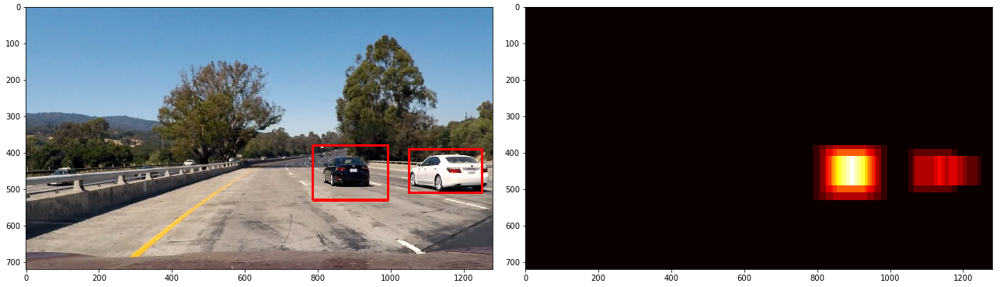

# **Vehicle Detection**

### **Project Overview**

This project contains the results from completing Project 5 of the Udacity Self-Driving Car Engineer Nanodegree.

#### Files in the repository
* The [Project Notebook](project_notebook.ipynb)
* A [Project Writeup](WRITEUP.md)
* The processed [output video](./output_videos/project_video_process.mp4)
* A [diagnostic video](./output_videos/project_video_process.mp4) with heatmaps overlaid atop the video frames

#### Running the code
This project was developed using Python 3.5. The project depends on the [NumPy](http://www.numpy.org/), [OpenCV](http://opencv.org/), [Scikit Learn](http://scikit-learn.org/), [Scikit Image](http://scikit-image.org/), [Matplotlib](http://matplotlib.org/) & [MoviePy](http://zulko.github.io/moviepy/) libraries.
