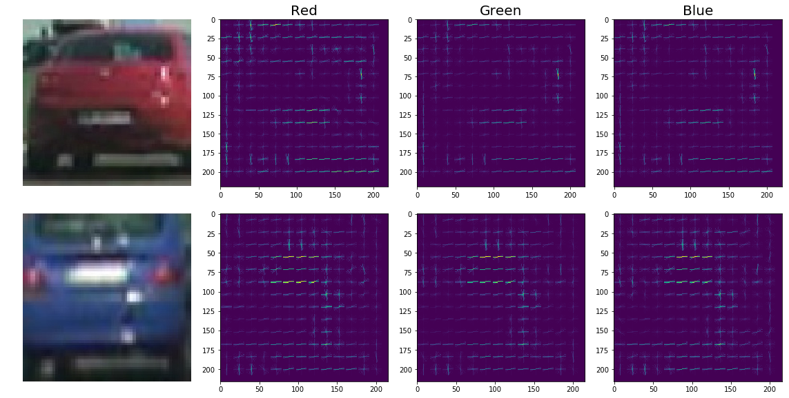
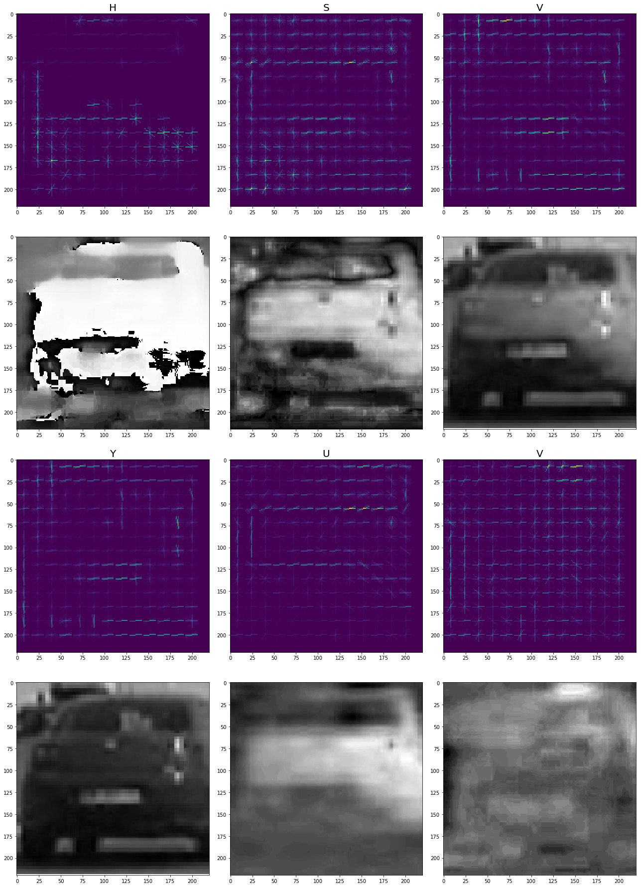
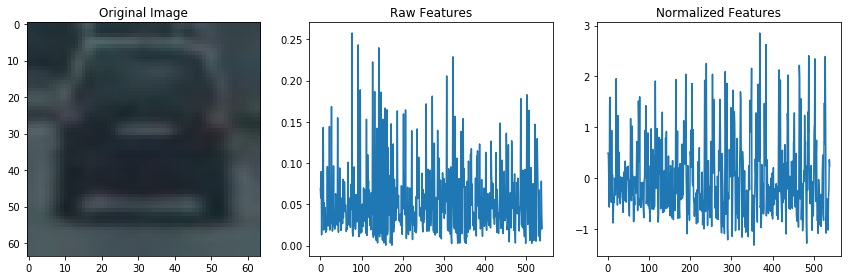
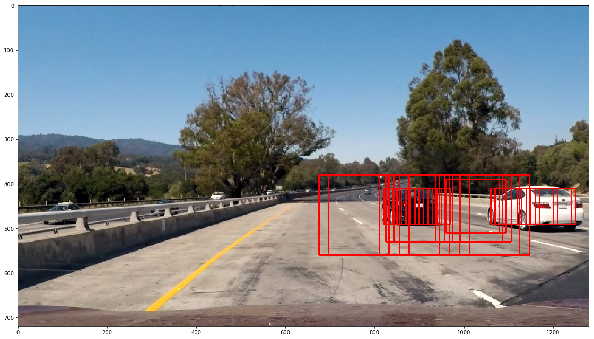
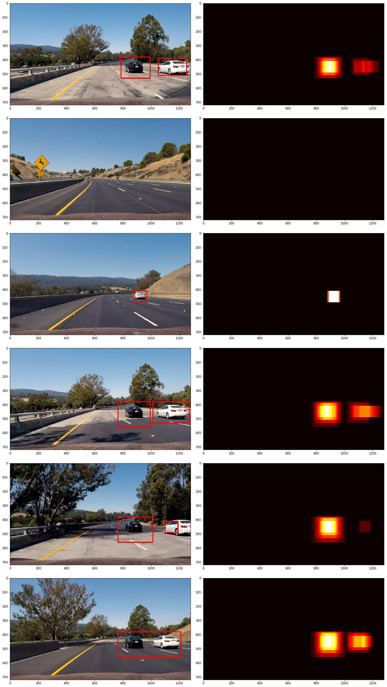

# **Vehicle Detection and Tracking**

The goal of this project is to build an object detector that detects and tracks cars in a video stream. I take advantage of a feature descriptor called a Histogram of Oriented Gradients (HOG)[1], which is a handy way of simplifying and extracting useful features from an image, and combine it with a machine learning classifier, specifically the Multi-layer Perceptron Classifier[2], in order to identify and track vehicles in a video stream.

## Histogram of Oriented Gradients (HOG)

A car is essentially a box with some other common characteristics like windshields, wheels, lights, etc. If we were to run something like a Canny edge detector on the image of a car, it would be easy to identify it as a car simply by looking at the edge image alone. In other words, we can simplify the image by discarding everything but the edges and still understand its content. The HOG feature descriptor takes this idea a few steps further by using the distribution (histogram) of gradient (x and y derivative) directions as features. The image below provides a visualization of the sorts of features a HOG descriptor extracts.



Pictured to the right of the car images are 3 visualizations of HOG descriptors that were applied to the Red Green and Blue channels of the cars. This provides some insight into the sorts of information that is extracted by the descriptor. If you squint, you begin to see where the prominent edges and corners have been extracted. It also highlights the fact that across all 3 channels of an RGB image, the features are very nearly identical. This is because the standard RGB encoding of colors used by typical images only separates the red, green and blue components of the image while distributing the values pretty evenly across the channels. This limits how much information the HOG descriptor can extract. However, by choosing a different color space, we can glean more information.

### Exploring Alternate Color Spaces



The above images visualize the HOG descriptor as applied to the 3 channels of a car image in both the HSV and YUV color spaces. In this case, we can distinguish clear differences between each of the image channels, meaning we can potentially extract more useful information for identifying and classifying vehicles! While this is great news, we won't know for sure which of the color spaces gives the most useful information for classification until we actually test them empirically. However, even by simply eyeing the two sets of HOG images above, the YUV color space appears to yield 3 channels that are each distinct from the other, whereas the HOG images taken from the HSV channels appear to be rather similar for the second and third (S and V) channels. And indeed, after some experimentation, the YUV space does appear to give the best results for accurate classification, at least where the HOG descriptor is concerned.

### Dataset

For this project, I used a labeled dataset with 8,792 "vehicle" and 8,968 "non-vehicle" examples to train my classifier. These images come from a combination of the [GTI vehicle image database](http://www.gti.ssr.upm.es/data/Vehicle_database.html) and the [KITTI vision benchmark suite](http://www.cvlibs.net/datasets/kitti/).

### Preparing the Data

Many machine learning classifiers behave badly if the individual features do not more or less look like standard normally distributed data (e.g. Gaussian with 0 mean and unit variance). For this reason, I centered and scaled by feature data using Scikit-Learn's Standard Scaler[5].



Apart from that and converting the images to YUV, no other massaging of the data was needed to yield good results with this project.


## Training a Machine Learning Classifier

I selected 3 different classifiers to test for this project: the Linear Support Vector Classifier[1], the K Nearest Neighbors Classifier[2], and the Multi-layer Perceptron mentioned above. By applying each of these to various permutations of the HOG parameters (described below), I determined that the K Nearest Neighbors classifier was not nearly as good a performer for this particular task as the other two. However, the performance of the SVC and MLP classifiers was similar. Ultimately, the Multi-layer Perceptron classifier performed better on the smaller set of features for which I was optimizing and provided quite stable results compared to the other two. Additionally, the MLP classifier offers a `predict_proba` method, which outputs a likelihood score for each classification. This allowed me to filter out a lot of false positives right out of the gate by simply discarding all predictions with less than 99% likelihood.

I decided to make the classifier into a Python class, which would save references to the trained model, the feature scaler, and the prediction threshold on instantiation. The code for this simple class is as follows:

```
class Classifier:
    def __init__(self, model, scaler, threshold=.99):
        self.model = model
        self.scaler = scaler
        self.threshold = threshold

    def is_car(self, X):
        scaled_X = self.scaler.transform(X)
        prediction = self.model.predict_proba(scaled_X)
        return prediction[0,1] > self.threshold
```

### Exploring the HOG Parameters

Our HOG descriptor function allows us to specify a number of parameters, including the number of orientations, the pixels per cell, the cells per block and so on. My goal was to find a set of parameters that would maximize classification accuracy while minimizing the number of features. More features means more compute time for each image, so it was important to try and control this factor. In order to discover the set of parameters which got the results I wanted, I created a small routine to generate permutations of parameters and test them on 1000 randomly sampled car and non-car images. I then used cross validation with 5 folds to generate a good estimate of how each classifier performed with the HOG descriptor and its given parameters. Below is a truncated table of some of the results, sorted by the accuracy of the predictions.

```
-----------------------------------------------------------------
orientations  px_per_cell  accuracy  confidence int  num features
=================================================================
8.0           12.0         0.986     +/- 0.020       1536.0
11.0          16.0         0.982     +/- 0.026       1188.0
12.0          16.0         0.978     +/- 0.015       1296.0
12.0          12.0         0.976     +/- 0.020       2304.0
13.0          15.0         0.974     +/- 0.016       1404.0
8.0           15.0         0.974     +/- 0.020       864.0
12.0          11.0         0.972     +/- 0.029       2304.0
12.0          15.0         0.972     +/- 0.026       1296.0
10.0          16.0         0.970     +/- 0.025       1080.0
13.0          16.0         0.970     +/- 0.046       1404.0
13.0          14.0         0.970     +/- 0.033       1404.0
8.0           16.0         0.970     +/- 0.022       864.0
10.0          12.0         0.970     +/- 0.035       1920.0
13.0          12.0         0.968     +/- 0.039       2496.0
9.0           16.0         0.968     +/- 0.015       972.0
13.0          13.0         0.968     +/- 0.008       1404.0
10.0          14.0         0.968     +/- 0.032       1080.0
11.0          12.0         0.966     +/- 0.021       2112.0
```

As these results were derived from a randomly sampled set of images, there was some variation from one run to the next, so I took the exact ordering of the results with a grain of salt. However, it did tell me that parameters yielding smaller numbers of features could potentially perform as well as those yielding much larger numbers of features. I focused on the parameters that yielded the smaller number of features and tested each of these empirically on the videos to see which gave the best results.

I created a `FeatureExtractor` class that would take the various HOG parameters on instantiation, and make some necessary calculations in order to translate from standard pixel coordinates to the multi-dimensional space of a hog descriptor. This makes it possible to extract the HOG features specific to any given region extracted from an image, as in a sliding window search (see below). The code for this class can be found in the project notebook in the cell labeled [Feature Extractor Class](project_notebook.ipynb#Feature-Extractor-Class)

### Additional features

It should be noted that I also explored other means of extracting features, such as histograms of color and binning the spatial information in various ways. However, each of these added significantly to the number of features, considerably slowing down time it took to process each frame. They also gave inferior results, with far more false positives identified than with just the HOG descriptor and a good set of parameters.

## Sliding Window Search

Now that we have a good feature descriptor and object classifier, the problem still remains that the classifier was trained on cropped, tightly zoomed in images, all of the same size, whereas the real data will have cars in varying sizes appearing all across the image frame.

In order to overcome this problem, we use a sliding window approach, where windows of varying sizes are moved incrementally across the image, resized to 64x64px, which is the size of the training data, and the classifier makes its prediction on each of these windows.

### Narrowed Search Region

Since the region where cars are likely to be found in an image is limited, I limited my search area to only that part of an image most likely to contain cars, i.e. below the horizon line. Also, since cars are likely to be different sizes in the image, depending on where they are located in space relative to the camera, I chose to search regions of varying scales. Below is any image of a number of windows that have all identified a particular region believed to contain a car. Note that this does not show *all* of the sliding windows, only those for the frames where the prediction of "car" was activated.



### False positives

Inevitably, even the best classifier will occasionally make incorrect predictions. In order to correct for this, I considered how many overlapping windows a particular region of an image contained. If we consider each prediction of "car" as a vote by the classifier that a particular region contains a car, we can reason that many votes cast for the same region means that it is far more likely to an accurate prediction.

I implemented this idea by adding 1 to each region of the image predicted by the classifier to be a car. We can visualize what this looks like with a heat map, where brighter colors correspond to more votes.



By setting any region of the image with fewer than some threshold of votes to zero, we eliminate positive predictions that are likely to be outliers. The code for the Sliding Window Search is implemented as a Python class in the project notebook cell labeled [Window Slider Class](project_notebook.ipynb#Window-Slider-Class).

### Exploiting the Video Stream

Videos are sequences of images, typically with 30 image frames per second, where each frame is highly similar to the frame immediately preceding it. It is possible to extend the idea of an ensemble of votes cast by the classifier from 2 dimensions (X and Y) to 3 (time). That is, by adding up the heatmaps across some frames, we can obtain an even more stable set of predictions. With some trial and error, I determined that I could get good, stable results by summing heatmaps taken from the last 10 frames and discarding any part of the heatmap with fewer than 15 votes. Python has a `deque` data structure, which means a "double ended queue". It allows one to specify a `maxlen` property. Each time an item is pushed onto the queue, only the most recent items up to `maxlen` will be kept and any others discarded. This creates a rolling temporal window in addition to the 2-dimensional sliding windows.

### Drawing Bounding Boxes

OpenCV offers a convenience method `cv2.findContours()` that finds the bounding contours of individual shapes in an image. Applying this to the heatmap, we can quickly find the outer contours of the "hot" zones int he image. Once these are determined, OpenCV has a second method `cv2.boundingRect()` that will draw a minimal bounding box around a contour. The code for this procedure is found among the helper functions found in cell 5 of the project notebook.

### Exploiting the Time Dimension

Videos are sequences of images, typically with 30 image frames per second, where each frame is highly similar to the frame immediately preceding it. It is possible to extend the idea of an ensemble of votes cast by the classifier from 2 dimensions (X and Y) to 3 (time). That is, by adding up the heatmaps across some number frames, we can obtain an even more stable set of predictions. Python has a `deque` data structure, which means a "double ended queue". By specifiying the `maxlen` property at instantiation, each time an item is pushed onto the resulting buffer, only the most recent items up to `maxlen` will be kept and any others discarded. This creates a rolling temporal window in addition to the 2-dimensional sliding windows. With some trial and error, I determined that I could get good, relatively smooth results by summing the heatmaps taken from the last 10 frames (i.e. 1/3 of a second) and discarding any part of the result with fewer than 15 votes.

## Output Videos

The video output for this project can be found [here](./output_videos/project_video_process.mp4). I also saved a [diagnostic video](./output_videos/project_video_diagnostic.mp4) with the heatmaps overlaid on the video frames for visualization purposes.

## Considerations for Future Improvements

### Speed

The speed of processing the vehicle detection across frames would need to be improved to run this detector in real time. Currently it runs at about 6 frames per second. The search windows are the same for each frame, so there is no need to repeatedly recalculate their positions. Rather, I believe a significant performance improvement could be made by vectorizing the search window slicing and running the detector on the full set of sliced images in one shot, rather than sequentially.

### Dynamic Detection zones

The search area in the videos is static. This doesn't translate well from one video to the next, as various factors like the field of view and pose of the camera will affect where in the frame the cars will be located. It might be useful in a real world detector to dynamically track the horizon line to ensure that the search windows are only considering relevant zones of the image.

## References

- [1] [Histogram of Oriented Gradients (HOG)](https://en.wikipedia.org/wiki/Histogram_of_oriented_gradients)
- [2] [Multi-layer Perceptron Classifier](http://scikit-learn.org/stable/modules/generated/sklearn.neural_network.MLPClassifier.html)
- [3] [Linear Support Vector Classifier](http://scikit-learn.org/stable/modules/generated/sklearn.svm.LinearSVC.html)
- [4] [K Nearest Neighbors Classifier](http://scikit-learn.org/stable/modules/generated/sklearn.neighbors.KNeighborsClassifier.html)
- [5] [Standard Scaler](http://scikit-learn.org/stable/modules/generated/sklearn.preprocessing.StandardScaler.html)
